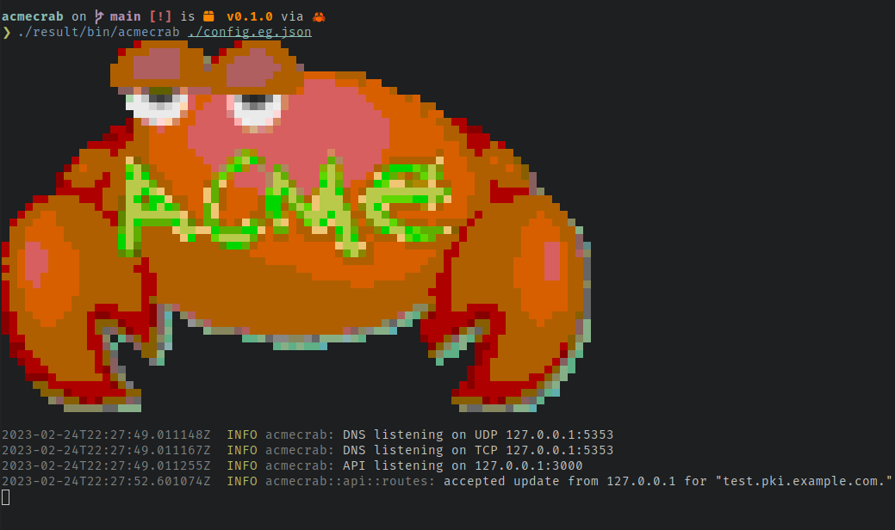

# ACME Crab

A very minimal stand-in for [acme-dns] well suited for [cryptokey routing] with [Wireguard].

Self-hosted option for securely allowing ACME clients to update TXT records to solve [RFC-8555][RFC-8555] [DNS-01] challenges for X509 certificate issuance. Works with all authoritative DNS hosting providers that support CNAME records.

[acme-dns]: https://github.com/joohoi/acme-dns
[cryptokey routing]: https://www.wireguard.com/#cryptokey-routing
[wireguard]: https://www.wireguard.com



* [Status](#status)
* [Features](#features)
* [Non-Features](#non-features)
* [Installation](#installation)
* [Configuration](#configuration)
  * [ACL](#acl)
  * [Additional addresses](#additional-addresses)
  * [Example](#example-configuration)
* [Initial DNS Setup](#initial-dns-setup)
* [ACME Client Setup](#acme-client-setup)
* [Why use ACME Crab?](#why-use-acme-crab)
  * [Why not acme-dns?](#why-not-acme-dns)
  * [Why not RFC-2136?](#why-not-rfc-2136)
* [API Examples](#api-examples)
* [Building from Source](#building-from-source)
* [Credits](#credits)

## Status

**Not quite complete and very BETA. Use at your own risk. Expect force pushes and history rewriting on main.**.

## Features

* Simple acme-dns compatible [update API] for ACME clients to provision
  TXT records. Works out-of-box with ACME clients compatible with [acme-dns].
* Answers [RFC-8555][RFC-8555] [DNS-01] challenges with provisioned records.
* Supports serving additional static A/AAAA/NS records.
* Listens for DNS queries over both UDP and TCP.
* Memory safe, asynchronous Rust implementation.
* Packaged as a [Nix] Flake.

[update API]: https://github.com/joohoi/acme-dns#update-endpoint
[RFC-8555]: https://www.rfc-editor.org/rfc/rfc8555
[DNS-01]: https://www.rfc-editor.org/rfc/rfc8555#section-8.4
[Nix]: https://nixos.org/

## Non-Features

ACME Crab is opinionated, and extremely minimal by design. If you're looking for a more complete
[acme-dns] replacement, consider [acme-dns-rust] (or just use [acme-dns]!).

* No register endpoint or username/passwords. Access-control is based on source
  IP and assumes you're using [cryptokey routing].
* No HTTPS for API, or self-managed HTTPS certificate. Uses plaintext HTTP and
  assumes data security is provided at another layer (e.g. [Wireguard]).
* No database backend. Optionally uses a flat file for data, or runs entirely stateless.
* No DNSSEC. C'mon. Gross...

[acme-dns-rust]: https://github.com/conblem/acme-dns-rust/

## Installation

**TODO(XXX): Describe using as a Nix flake input in NixOS**.

For now: [install from source](#Building-from-Source) and then set up some kind of `systemd` service.

## Configuration

ACME Crab uses a simple JSON configuration format. Unless otherwise specified all keys are mandatory.

| Key                    | Value                     | Description                                                                                                                                                                                                                           | 
|------------------------|---------------------------|---------------------------------------------------------------------------------------------------------------------------------------------------------------------------------------------------------------------------------------|
| `domain`               | FQDN                      | Fully qualified domain name for the ACME Crab server. All TXT records must be subdomains of this FQDN.                                                                                                                                |
| `ns_domain`            | FQDN                      | Fully qualified domain name for the nameserver to use in the SOA record for `domain`.                                                                                                                                                 |  
| `ns_admin`             | Email                     | Email address of the `ns_domain` administrator. Translated to record format (e.g. `foo@example.com` -> `foo.example.com`) automatically.                                                                                              |
| `txt_store_state_path` | (Optional) file path      | Path to a JSON data file for persisting TXT records across shutdown. E.g. `"/var/lib/acmecrab/data.json"`. Created at startup if it does not exist. If omitted, TXT records are kept in-memory only and are ephemeral across reboots. |
| `api_bind_addr`        | IP:port                   | Bind address for HTTP API. Must be a loopback address or private network. E.g. `127.0.0.1:3000`                                                                                                                                       |
| `api_timeout`          | # of seconds              | Maximum duration for an API request before timing out, expressed in seconds, E.g. `120`.                                                                                                                                              |
| `dns_udp_bind_addr`    | IP:port                   | UDP bind address for DNS API. E.g. `127.0.0.1:52`                                                                                                                                                                                     |
| `dns_tcp_bind_addr`    | IP:port                   | TCP bind address for DNS API. E.g. `127.0.0.1:52`                                                                                                                                                                                     |
| `dns_tcp_timeout`      | # of seconds              | Maximum duration for a TCP DNS request before timing out, expressed in seconds. E.g. `60`                                                                                                                                             |
| `acl`                  | See ACL.                  | A map of CIDR networks and  subdomains IPs within that network can updated TXT records for.                                                                                                                                           |
| `addrs`                | See additional addresses. | A map of fully qualified domains and IP addresses that should be used for A/AAAA queries for each domain.                                                                                                                             |
| `ns_records`           | See additional addresses. | A map of fully qualified domains to domain values that should be returned for NS lookups.                                                                                                                                             |
| `cname_records`        | See additional addresses. | A map of fully qualified domains to CNAME target domain values that should be returned for all lookups.                                                                                                                               |     
### ACL

The ACME Crab access control assumes you're using [cryptokey routing] and can infer trusted identity from source IP. The configuration file maps between CIDR networks and subdomains. ACME clients within a specified CIDR network can update TXT records for the listed subdomains using the HTTP API. Update API requests from IPs outside of the listed networks will be forbidden. Update API requests from approved networks for a subdomain not listed in the network's ACL will be forbidden.

E.g. if we have an ACL config:
```json
{
  "domain": "pki.example.com",
  ...
  "acl": {
    "10.0.0.5/32": [ "foo" ],
    "127.0.0.0/24": [ "bar", "baz" ]
  },
  ...
}
```

Then only source IP `10.0.0.5` can set TXT records for `foo.pki.example.com`, and source IPs `127.0.0.1 .. 127.0.0.255` can set TXT records for `bar.pki.example.com` and `baz.pki.example.com`.

### Additional Addresses

Above and beyond dynamic TXT records ACME Crab can return static A, AAAA and NS records based on your configuration. A and AAAA records are set by fully qualified domain name under the `addrs` key. NS records are set by fully qualified domain name under the `ns_records` key. CNAME records are set by fully qualified domain name under the `cname_records` key.

E.g. if we have the config:
```json
{
  ...
  "addrs": {
    "ipv4.example.com": ["93.184.216.34"],
    "dual.example.com": ["93.184.216.34", "2606:2800:220:1:248:1893:25c8:1946" ]
  },
  "ns_records": {
    "dual.example.com": ["ns1.pki.example.com"]
  },
  "cname_records": {
    "_acme-challenge.test.example.com": [ "test.pki.example.com" ]
  },
  ...
}
```

Then A lookups for `ipv4.example.com` or `dual.example.com` will return `93.184.216.34`, and AAAA lookups for `dual.example.com` will return `2606:2800:220:1:248:1893:25c8:1946`. NS lookups for `dual.example.com` will return `ns1.pki.example.com`. Lookups for any record type for `_acme-challenge.test.example.com` will return a CNAME to `test.pki.example.com`.

### Example Configuration

```json
{
  "domain": "pki.example.com",
  "ns_domain": "ns1.pki.example.com",
  "ns_admin": "dns-admin@example.com",
  "txt_store_state_path": "data.json",
  "api_bind_addr": "127.0.0.1:3000",
  "api_timeout": 120,
  "dns_udp_bind_addr": "127.0.0.1:5353",
  "dns_tcp_bind_addr": "127.0.0.1:5353",
  "dns_tcp_timeout": 60,
  "acl": {
    "127.0.0.1/32": [ "test" ],
    "10.0.0.0/32": [ "test2", "test3" ]
  },
  "addrs": {
    "pki.example.com": ["93.184.216.34", "2606:2800:220:1:248:1893:25c8:1946" ],
    "ns1.pki.example.com": ["93.184.216.34", "2606:2800:220:1:248:1893:25c8:1946" ]
  },
  "ns_records": {
    "pki.example.com": [ "ns1.pki.example.com" ]
  },
  "cname_records": {
    "_acme-challenge.test.example.com": [ "test.pki.example.com" ]
  }
}
```

This configuration: 

* Serves dynamic TXT records under `pki.example.com`. 
* Populates the zone SOA to use `ns1.pki.example.com` as a nameserver, administrated by `dns-admin.example.com`.
* Persists TXT record updates to `./data.json`. 
* Makes accessible an HTTP API at `http://127.0.0.1/3000`. 
* Responds to DNS requests made to `127.0.0.1:5252` via TCP or UDP. 
* Accepts TXT updates via the HTTP API from `127.0.0.1/32` for `test.pki.example.com`, and from `10.0.0.0/32` for `test2.pki.example.com` and `test3.pki.example.com`.
* Returns `93.184.216.34` for `A` lookups and `2606:2800:220:1:248:1893:25c8:1946` for `AAAA` lookups for `pki.example.com` and `ns1.pki.example.com`.
* Returns `ns1.pki.example.com` for `NS` lookups for `pki.example.com`.
* Returns CNAME redirection to `test.pki.example.com` for all lookups for `_acme-challenge.test.example.com`.

## Initial DNS Setup

Using ACME Crab to respond to DNS-01 challenges requires one-time initial setup of a CNAME delegation.

For each domain you wish to manage with ACME Crab you must add a `CNAME` record delegating the `_acme_challenge` subdomain to a subdomain of your ACME Crab server.

E.g. if I'm running ACME Crab at `pki.example.com` and want to use it to authorize issuance for `test-www.example.com` I would update the `example.com` DNS zone to add a `CNAME` record like:

```
_acme-challenge.test-www.example.com.	3600	CNAME	test-www.pki.example.com.
```

## ACME Client Setup

Configure your ACME client to use the "acme-dns" solution method. Specify the acme-dns server as the address of your ACME Crab instance. Details vary by ACME client.

For example, using [Lego] with ACME Crab running its HTTP API at `10.0.0.1:3000`:

```
ACME_DNS_API_BASE=http://10.0.0.1:3000 \
ACME_DNS_STORAGE_PATH=/tmp/unused.json \
  lego \
    --dns acme-dns \
    --domains test-www.example.com\
    --email admin@example.com \
  run
```

Consult your ACME client documentation for more information.

[Lego]: https://github.com/go-acme/lego

## Why use ACME Crab?

* You have one or more ACME clients issuing certificates for your domains.
* Your ACME clients have plugins to support [acme-dns].
* You want to use the DNS-01 challenge type to authorize issuance for your domains.
* You don't want to give your ACME clients free reign to update records in your DNS zones.
  * Or, you _can't_ dynamically update records in your DNS zones because your authoritative DNS provider has no API, or a shitty API.
* You already have a trusted encrypted link between where your ACME clients run, and where you want to run ACME Crab suitable for [cryptokey routing]. E.g. a Wireguard tunnel, or some kind of Tailscale setup.
* You're comfortable with all of the above terminology and expect limited to no support from the author.
* You like Rust, and minimal software.

### Why not acme-dns?

I <3 [acme-dns]. It's a great project! If you want something battle tested and full featured, give it a go. You may prefer ACME Crab instead of [acme-dns] if:

* You don't want the hassle of API usernames/passwords because you're relying on authentication at the network layer.
* You don't want the hassle of HTTPS for the API, because you're relying on encryption at the network layer.
* You don't want the hassle of a database backend (even SQLite), because ACME DNS-01 challenge responses are ephemeral, seldom updated, and require no sophisticated query patterns.
* You like crabs more than gophers.

### Why not RFC-2136?

The venerable [RFC-2136] offers a provider independent way to dynamically update DNS records. Many ACME clients have a plugin to support using this method for updating TXT records to respond to DNS-01 challenges. You may prefer ACME Crab instead of [RFC-2136] if:

* Your authoritative DNS provider doesn't offer RFC-2136 support. ACME Crab only requires a one time CNAME addition in your authoritative zone. No API or RFC-2136 support is needed.
* You want tight control over the allowed updates. ACME Crab only allows updating TXT records and enforces that update values are RFC 8555 compliant DNS-01 challenge response values. An ACME client can never use ACME Crab to change an A, AAAA, MX or NS record in your zone. Similarly an ACME client can never use ACME Crab to publish arbitrary content under a TXT record.

[RFC-2136]: https://www.rfc-editor.org/rfc/rfc2136

## API Examples

_Note: These actions are typically undertaken by your ACME client using a compatible acme-dns plugin. These examples are useful for testing only._

```bash
# Healthcheck
❯ curl http://localhost:3000/healthcheck
{"ok":"healthy"}
```

```bash
# Set a dynamic TXT record for test.pki.example.com
❯ curl --json \
  '{"subdomain":"test","txt":"LPsIwTo7o8BoG0-vjCyGQGBWSVIPxI-i_X336eUOQZo"}' \
   http://localhost:3000/update
{"txt":"LPsIwTo7o8BoG0-vjCyGQGBWSVIPxI-i_X336eUOQZo"}   
```

```bash
# Check dynamic TXT record (UDP)
❯ dig @127.0.0.1 -p 5353 +short test.pki.example.com TXT
"LPsIwTo7o8BoG0-vjCyGQGBWSVIPxI-i_X336eUOQZo"

# Check dynamic TXT record (TCP)
❯ dig @127.0.0.1 -p 5353 +tcp +short test.pki.example.com TXT
"LPsIwTo7o8BoG0-vjCyGQGBWSVIPxI-i_X336eUOQZo"

# Lookup static A record.
❯ dig @127.0.0.1 -p 5353 +short pki.example.com A
93.184.216.34

# Lookup static AAAA record.
❯ dig @127.0.0.1 -p 5353 +short pki.example.com AAAA
2606:2800:220:1:248:1893:25c8:1946
```

## Building from Source

### With Nix

1. Install [Nix] v2.4+.
2. Build ACME Crab:
```
nix build github:cpu/acmecrab
```

### Cargo

1. Install [Rust].
2. Build ACME Crab:
```
cargo build --release
```

[Rust]: https://www.rust-lang.org/tools/install

## TODO

There are a few things left to do before considering ACME Crab "ready":

* [X] NixOS module - [#1]
* [ ] Unit tests - [#2]
* [ ] Integration tests - [#3]
* [ ] Field testing. - [#4]

[#1]: https://github.com/cpu/acmecrab/issues/1
[#2]: https://github.com/cpu/acmecrab/issues/2
[#3]: https://github.com/cpu/acmecrab/issues/3
[#4]: https://github.com/cpu/acmecrab/issues/4

## Credits

* [Cartoon crab] by [liftarn].
* [acme-dns] by [joohoi].

[Cartoon crab]: https://openclipart.org/detail/325249/cartoon-crab
[liftarn]: https://openclipart.org/artist/liftarn
[joohoi]: https://github.com/joohoi
